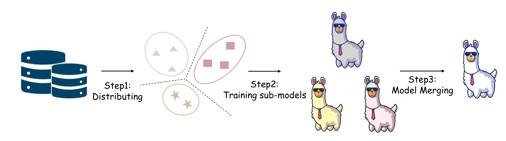
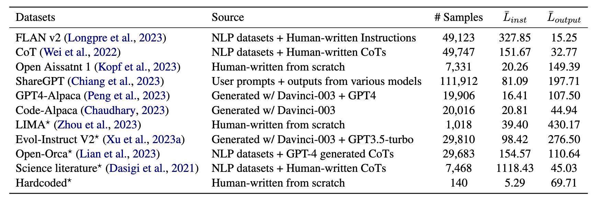

<p align="center" width="100%">
</p>

<div id="top" align="center">

Disperse-Then-Merge: Pushing the Limits of Instruction Tuning via Alignment Tax Reduction
-----------------------------

[](https://github.com/tatsu-lab/stanford_alpaca/blob/main/LICENSE)
[](https://github.com/tatsu-lab/stanford_alpaca/blob/main/DATA_LICENSE)
[](https://github.com/tatsu-lab/stanford_alpaca/blob/main/WEIGHT_DIFF_LICENSE)
[](https://www.python.org/downloads/release/python-380/)
[](https://github.com/psf/black)

<!-- <h4> |<a href="https://arxiv.org/abs/2310.09168"> 📑 Paper </a> |
<a href="https://huggingface.co/datasets?sort=trending&search=Explore_Instruct"> 🤗 Data </a> |  
<a href="https://huggingface.co/models?sort=trending&search=Explore-LM"> 🤗 Model </a> |
<a href="https://github.com/fanqiwan/Explore-Instruct"> 🐱 Github Repo </a> |
</h4> -->

<!-- **Authors:** -->

_**Tingchen Fu<sup>‡†</sup>, Deng Cai<sup>‡</sup>, Lemao Liu<sup>‡</sup>, Shuming Shi<sup>‡</sup>, Rui Yan<sup>†</sup>**_


<!-- **Affiliations:** -->


_<sup>†</sup> Gaoling School of Artificial Intelligence, Renmin University of China_

<sup>‡</sup> Tencent AI Lab

</div>


<!-- ## News
- **Oct 16, 2023:** 🔥 We're excited to announce that the Explore-Instruct datasets in brainstorming, rewriting, and math domains are now available on 🤗 [Huggingface Datasets](https://huggingface.co/datasets?sort=trending&search=Explore_Instruct)! Additionally, we've released Explore-LM models that have been initialized with LLaMA-7B and fine-tuned with the Explore-Instruct data in each domain. You can find these models on 🤗 [Huggingface Models](https://huggingface.co/models?sort=trending&search=Explore-LM). Happy exploring and instructing! -->

## Contents

- [Disperse-Then-Merge: Pushing the Limits of Instruction Tuning via Alignment Tax Reduction](#disperse-then-merge-pushing-the-limits-of-instruction-tuning-via-alignment-tax-reduction)
- [Contents](#contents)
- [Overview](#overview)
- [Step1: Data Distributing](#step1-data-distributing)
- [Step2: Training Sub-Models](#step2-training-sub-models)
- [Step3: Model Merging](#step3-model-merging)
- [License](#license)
- [Contact](#contact)

## Overview

<!-- We propose Explore-Instruct, a novel approach to enhancing domain-specific instruction coverage. We posit that the domain space is inherently structured akin to a tree, reminiscent of cognitive science ontologies. Drawing from the essence of classical search algorithms and incorporating the power of LLMs, Explore-Instruct is conceived to actively traverse the domain space and generate instruction-tuning data, **not** necessitating a predefined tree structure. Specifically, Explore-Instruct employs two strategic operations: lookahead and backtracking exploration: -->

Supervised fine-tuning (SFT) on instruction-following corpus is a crucial approach toward the alignment of large language models (LLMs). However, the performance of LLMs on standard knowledge and reasoning benchmarks tends to suffer from deterioration at the latter stage of the SFT process, echoing the phenomenon of alignment tax. Through our pilot study, we put a hypothesis that the data biases are probably one cause behind the phenomenon. To address the issue, we introduce a simple disperse-then-merge framework composed of three steps: 

+ Data Distributing: We disperse the instruction-following data into portions.
+ Training Sub-Models: We train multiple sub-models using different data portions.
+ Model Merging: We merge multiple models into a single one via model merging techniques.


<p align="center">
     <br>
</p>


## Step1: Data Distributing
We use [allenai/tulu-v2-sft-mixture](https://huggingface.co/datasets/allenai/tulu-v2-sft-mixture) as our instruction-following data and keep only the first turn of query and response if there are multiple turns in a dialogue session. The statistics of our data is shonw as follows:

<p align="center">
     <br>
</p>


Use the following command to preprocess the instruction data:
```
python3 -u preprocess.py \
  --dataset allenai/tulu-v2-sft-mixture \
  --n_cluster 4 \
  --output_file PATH_TO_OUTPUT \
  --output_cluster PATH_TO_OUTPUT_CLUSTER \

```


## Step2: Training Sub-Models

Next we perform SFT on sub-models using the following command:

```
RUN_DIR="$PWD"
for cluster_id in 0 1 2 3 
do 
    torchrun --nproc_per_node=8 --master_port=1234  code/submodel_training.py  \
        --model_name_or_path meta-llama/Llama-2-7b-hf \
        --label_names labels  \
        --train_file  PATH_TO_TRAIN_DATA e.g., ${RUN_DIR}/data/tulu_v2.json  \
        --cluster_file PATH_TO_TRAIN_CLUSTER e.g., ${RUN_DIR}/data/tulu_v2_cluster.json  \
        --data_ratio   1.0  \
        --cluster_id ${cluster_id}  \
        --do_train  \
        --fp16  True    \
        --bf16  False    \
        --load_in_4bit False  \
        --bnb_4bit_quant_type nf4   \
        --bnb_4bit_compute_type  float16  \
        --peft_type lora \
        --lora_modules gate_proj,up_proj,down_proj \
        --lora_alpha 16 \
        --lora_r 16 \
        --lora_dropout 0.05 \
        --block_size 1024  \
        --per_device_train_batch_size 1 \
        --per_device_eval_batch_size 1 \
        --adam_beta1 0.9 \
        --adam_beta2 0.98 \
        --adam_epsilon 1e-6 \
        --gradient_accumulation_steps 2 \
        --num_train_epochs 1 \
        --learning_rate 3e-4 \
        --lr_scheduler_type cosine \
        --max_grad_norm 0.3 \
        --weight_decay 0.0 \
        --warmup_steps 100 \
        --warmup_ratio 0 \
        --logging_steps 10 \
        --save_total_limit 1 \
        --evaluation_strategy "no" \
        --save_strategy "epoch" \
        --save_steps 1000 \
        --eval_steps 1000 \
        --metric_for_best_model loss \
        --output_dir PATH_TO_SAVE_DIR \
        --ddp_find_unused_parameters False  \
        --overwrite_output_dir  \
done
```

## Step3: Model Merging

After training, we merge the sub-models into a single model using the following command:

```
python -u code/script/merge.py \
    --ckpt_paths PATH_TO_SUBMODEL_CHECKPOINTS \
    --output_path PATH_TO_MERGED_CHECKPOINT \
    --mix_ratio 1,1,1,1  \

```


## License

The work is intended and licensed for research use only. The dataset is CC BY NC 4.0 (allowing only non-commercial use) and models trained using the dataset should not be used outside of research purposes. 


## Contact
Please feel free to reach out to us if you have any questions or suggestions. You can contact us via the following email addresses: lucas.futingchen@gmail.com


<!-- 
## Citation

If you find this work is relevant with your research or applications, please feel free to cite our work!
```
@misc{wan2023explore,
   title={Explore-Instruct: Enhancing Domain-Specific Instruction Coverage through Active Exploration},
   author={Fanqi, Wan and Xinting, Huang and Tao, Yang and Xiaojun, Quan and Wei, Bi and Shuming, Shi},
   year={2023},
   eprint={2310.09168},
   archivePrefix={arXiv},
   primaryClass={cs.CL}
}
``` -->

<!-- ## Acknowledgments

This repo benefits from [Stanford-Alpaca](https://github.com/tatsu-lab/stanford_alpaca) and [Vicuna](https://github.com/lm-sys/FastChat). Thanks for their wonderful works! -->